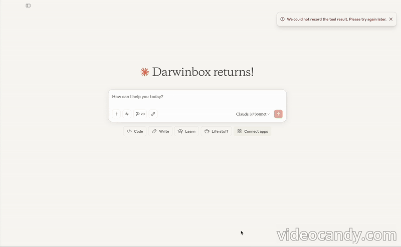

# Darwinbox HRMS MCP Server

A Model Context Protocol (MCP) server for interacting with the Darwinbox HRMS API. This server provides tools for managing employee data, attendance, and leave management through a standardized interface.

## Demo



## Features

### Core Tools
- Employee Management
  - Get employee details (single, multiple, or all employees)
  - Update employee information
  - Add new employees
  - Deactivate employees
  - Download personal documents
  - Get employee history
  - Get position master data
  - Get forms data
  - Get separation details
  - Upload profile attachments

### Time Management Tools
- Attendance Management
  - Get monthly attendance
  - Get daily attendance
  - Get attendance roster
  - Record attendance punches
  - Record backdated attendance
- Leave Management
  - Approve leaves
  - Get leave action history
  - Get holiday list
  - Get leave balance
  - Import leaves

## Installation

1. Clone the repository:
```bash
git clone https://github.com/prithvidbox/darwinbox-mcp
cd darwinbox-server
```

2. Install dependencies:
```bash
npm install
```

3. Build the project:
```bash
npm run build
```

## MCP Client Configuration

### Claude Desktop Client
```json
{
  "mcpServers": {
    "darwinbox": {
      "command": "node",
      "args": ["path/to/darwinbox-server/build/index.js"],
      "env": {
        "DARWINBOX_DOMAIN": "https://your-domain.darwinbox.in",
        "DARWINBOX_CLIENT_ID": "your-client-id",
        "DARWINBOX_CLIENT_SECRET": "your-client-secret",
        "DARWINBOX_GRANT_TYPE": "authorization_code",
        "DARWINBOX_CODE": "your-auth-code",
        "DARWINBOX_DATASET_KEY": "your-dataset-key"
      },
      "disabled": false,
      "autoApprove": []
    }
  }
}
```

### Cline Configuration
```json
{
  "servers": {
    "darwinbox": {
      "command": "node",
      "args": ["path/to/darwinbox-server/build/index.js"],
      "env": {
        "DARWINBOX_DOMAIN": "https://your-domain.darwinbox.in",
        "DARWINBOX_CLIENT_ID": "your-client-id",
        "DARWINBOX_CLIENT_SECRET": "your-client-secret",
        "DARWINBOX_GRANT_TYPE": "authorization_code",
        "DARWINBOX_CODE": "your-auth-code",
        "DARWINBOX_DATASET_KEY": "your-dataset-key"
      }
    }
  }
}
```

### Cursor Configuration
```json
{
  "mcpServers": {
    "darwinbox": {
      "command": "node",
      "args": ["path/to/darwinbox-server/build/index.js"],
      "env": {
        "DARWINBOX_DOMAIN": "https://your-domain.darwinbox.in",
        "DARWINBOX_CLIENT_ID": "your-client-id",
        "DARWINBOX_CLIENT_SECRET": "your-client-secret",
        "DARWINBOX_GRANT_TYPE": "authorization_code",
        "DARWINBOX_CODE": "your-auth-code",
        "DARWINBOX_DATASET_KEY": "your-dataset-key"
      }
    }
  }
}
```

## Authentication

The server uses OAuth 2.0 for authentication. It automatically handles:
1. Token acquisition using the provided credentials
2. Token management and renewal
3. Authenticated API requests with proper headers

## Error Handling

The server provides detailed error messages for:
- Missing or invalid configuration
- Authentication failures
- Invalid API requests
- API response errors


## License

This project is licensed under the MIT License - see the LICENSE file for details.
